# Snakes and Ladders

A console-based implementation of the classic **Snakes and Ladders** game written in Java.

## Requirements & Features

This project implements the game with the following customizable features and requirements:
*   **Custom Board Size**: Players can define the size of the board (e.g., 100 squares).
*   **Custom Number of Snakes and Ladders**: The game randomly generates snakes and ladders on the board based on the count provided by the user.
*   **Multiplayer Support**: Allows a custom number of players.
*   **Bot Player**: Option to include an automated bot player.
*   **Customizable Dice**: Players can choose the number of dice rolled per turn and the number of faces on each die (default is 1 die with 6 faces).
*   **Game Rules**:
    *   Players take turns rolling the dice.
    *   If a player lands on the bottom of a ladder, they climb to the top.
    *   If a player lands on the head of a snake, they slide down to the tail.
    *   To win, a player must land exactly on the final square (board size). If a roll would take them beyond the final square, they stay in their current position.
    *   The game ends when the first player reaches the final square.

## Class Diagram

Below is the class diagram showing the structure of the application and the relationships between its models and services.

```mermaid
classDiagram
    class Main {
        +main(String[] args)
    }

    class GameStatus {
        <<enumeration>>
        IN_PROGRESS
        FINISHED
    }

    class PlayerType {
        <<enumeration>>
        HUMAN
        BOT
    }

    class Board {
        -int size
        -int numberOfSnakes
        -int numberOfLadders
        ~Map~Integer, Integer~ snakes
        ~Map~Integer, Integer~ ladders
        +Board(int size, int numberOfSnakes, int numberOfLadders)
        +getSize() int
        +getSnakes() Map
        +getLadders() Map
        -setRandomSnakes(int boardSize, int numberOfSnakes)
        -setRandomLadders(int boardSize, int numberOfLadders)
    }

    class Dice {
        -int minValueOfFace$
        -int numberOfDice
        -int numberOfFaces
        ~Random random
        +Dice(int numberOfDice, int numberOfFaces)
        +roll() int
    }

    class Player {
        -String name
        -PlayerType playerType
        -int position
        +Player(String name, PlayerType playerType, int position)
        +getName() String
        +getPosition() int
        +setPosition(int position)
    }

    class Game {
        +Board board
        +List~Player~ players
        +Dice dice
        +GameStatus gameStatus
        +int currentPlayerIndex
        +Game(...)
    }

    class GameBuilder {
        +buildFromConsole() Game
    }

    class GameService {
        ~Random random
        +gameStart(Game game)
        -checkIfWinner(Game game) boolean
        +checkForSnakesAndLadders(Game game)
    }

    class PlayerService {
        +takeTurn(Game game, Player player)
    }

    Game "1" *-- "1" Board
    Game "1" *-- "1" Dice
    Game "1" *-- "*" Player
    Game *-- GameStatus
    Player *-- PlayerType
    
    GameBuilder ..> Game : creates
    GameService ..> Game : operates on
    GameService ..> PlayerService : uses
    Main ..> GameBuilder : starts
    Main ..> GameService : starts
```



## How to Run

### Prerequisites
*   Java Development Kit (JDK) 8 or higher installed on your system.

### Steps to Compile and Execute

1.  **Open a terminal** and navigate to the project's root directory:
    ```bash
    cd /path/to/SnakesAndLadders
    ```

2.  **Compile the Java files**:
    Create an output directory and compile the `.java` files from the `src` directory into it.
    ```bash
    mkdir -p out
    javac -d out $(find src -name "*.java")
    ```
    *Note: On Windows, you can compile with `javac -d out src/**/*.java` or similar depending on your shell.*

3.  **Run the game**:
    Execute the `Main` class.
    ```bash
    java -cp out Main
    ```

4.  **Play**:
    Follow the interactive console prompts to configure the game and play!

## Application Structure Details

*   **`model` package**: Contains the core entities of the game (`Board`, `Dice`, `Game`, `Player`).
*   **`service` package**: Contains the business logic.
    *   `GameBuilder`: Handles user input and the initialization of the game state.
    *   `GameService`: Manages the main game loop, checking for winners, and applying snake/ladder movements.
    *   `PlayerService`: Handles individual player turns and dice rolling.
*   **`enums` package**: Holds enumerations for `GameStatus` and `PlayerType`.
